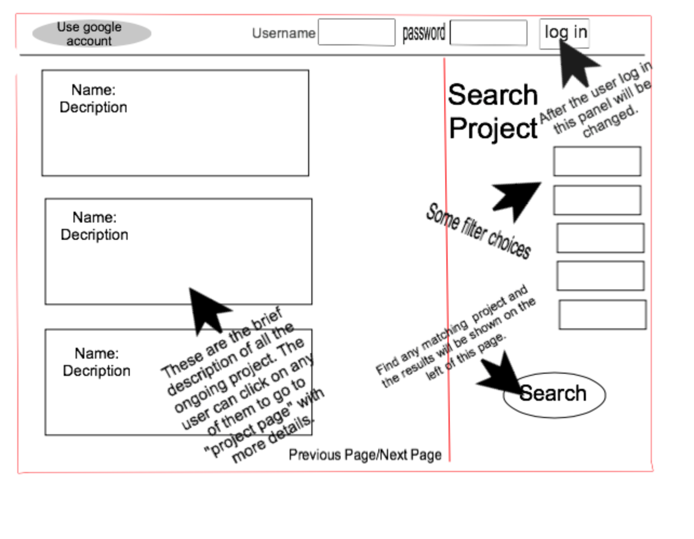
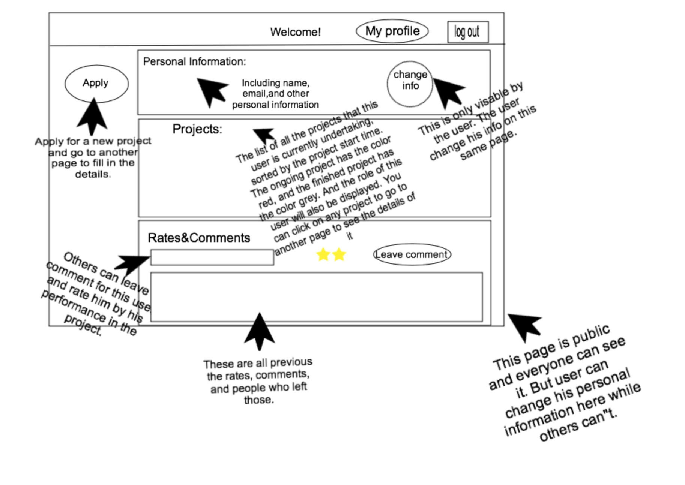
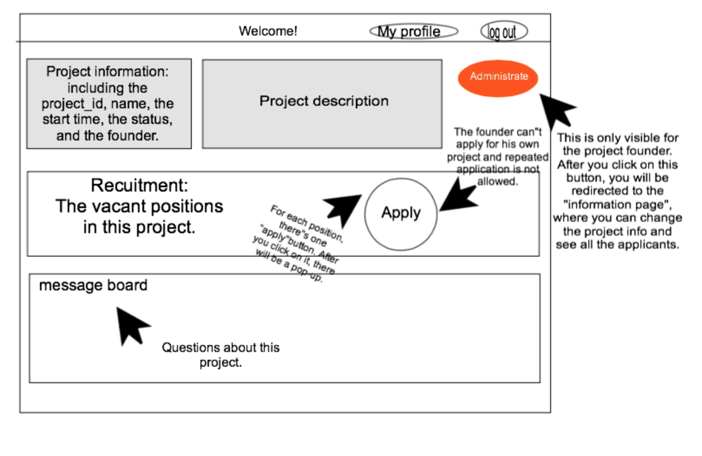

# Phase 2

## Group Member

Baige Liu
`g5liubai`

Zhiyu Kang
`g5garyk`

Xiaoyu Yan
`c4yanxia`

## Features:
- **User Authentication**: Verifying a user account. 
- **User Profile**: Each user has a profile including privacy informations, emails, majors, skills, experiences, current projects and rating history.
- **User Interactions**: A user can post a project and becomes a project initiator. Users can read the description and requirement of projects and submit applications to initiators. Initiators can accept any number of applications to form a group.
- **Implicit Social Networking**: Users in a same project are automatically considered as friends. They can check each other's information that only friends have the privilege.
- **Reputation System**: Users can comment a posted project. When a project finished, group members can rate each other and leave comments. Initiators can check applicants' rating level and read their partner comments history.
- **Search and Recommendation System:** Users can search projects by keywords or other users by account name. When Initiators post a project, platform will recommend users having relevant skills and high rates to the initiator.
- **Administrative View**: The project administrative view allows initiators to check the applicant list of a project and add or remove group members.

## Project Structure
We are using MEAN stack to build this project.
- ``Design Pattern``: MVC.
- ``MongoDB``: Database
- ``Express.js``: Controller, Driver
- ``Angular.js``: Controller, Template
- ``Node.js``: Server
- ``Bootstrap``: Style
- ``Library``: mongoose.js, passport.js

## Database Schema
We are going to use mongodb with mongoose module in our project. The database saves all informationsabout our website, and provide functionality of all database operations. Whenever the pages need to interact with database, this module should be used.
The followings are our database schemas:
- `User`:  { UserID, PassWord, Email, Ceil, Projects(list of project ids), Skills(list of skills, Rating(list of ratingID))}
- `Project`: { ProjectID, Description, Start_time, Finish_time, Status,  Admin, Member{(list of userID) }, Comments(list of commentID) }
- `Rating`: { RatingID, RaterID, Stars, Comments}
- `Comment`: {CommentID, ProjectId, UserId, Time, Content}

## Module Design
### Authentation module
We would use the module express-session from express to preventing users browse un-authorized content. This module, at first, works for the information bar that check the login information. If the login information in correct, it would use the express-session module to keep track of login information so that every modules knows who they are dealing with. As are result, we are able to modify the content of pages dynamically based on users’ premissions.

### Main page search module
The Main page search module is responsible for the display on main page. At first, by default, it would display the top 10 recently added project to view, and the numbers of current ongoing projects, finished pages and number of users. Also, it uses database module to get different pre-defined results that corresponding to pre-defined search buttons on the main page, and display the result on main page. Also, it allows user to search by key words. This also interacts with our database and display the results on the main page.

### Panel module
The panel module provides functionality of upper side panel for all pages. This module takes the session information from authenation module, provide and display the corresponding functionalities that the user now can choose on the panel. 

### Profile Module
This module is responsible for the profile page. Firstly, this module checks where the request comes from. If the user is authenticated, it will display the complete information about a user with update options. Otherwise, the profile page only shows public information about a user without privacy informations. Authenticated users can update their informations such as password, email, cell number. This module also displays a list of projects and ratings related to the user.

### Project Module
This module is responsible for managing project informations. It can get project informations from database and return the relevant projects according to reqirments. If the request comes from the publisher, the module will show the publisher update options so that the publisher can modify the project. If the request comes from a project member, the member can quit this project. This module also can be used to create a new project.

### Rating Module
This module is used to rate and comment a user or project. Group members can use this module to rate each other when the project is finished. Users can also use this module to comment a project so that users who are interested in the same project can interact with each other.

### Recruitment Module
The project page will use this module. If the request comes from a publisher, this module displays all the applications so that the publisher can accept or refuse an application. Publishers can also delete a member before the project finished. If the request comes from a normal user and the project's state is still in recruiting, this module will display apply options, users can apply for the relevant positions as the publisher's requirments.

## Page&Interaction Design

### Home Page



### Profile Page


### Project Page


### Information Page


## REST API Design
### Project
- GET/api/projects
 - Get all projects.
 - Output:
 ````
 {
	{	
		"ProjectID": ,
		"Start_time": ,
		"Finish_time": ,
		"Status": ,
		"Admin": ,
		"Members": [user_id1, user_id2,...],
		"Comments": [comment_id1, comment_id2,...]
	},
	{
	 project2
	},
	{
	 project3
	},
	...
 }
 ````
- POST/api/projects
 - Create a new projects.
- GET/api/projects/<project_id>
 - Get a single project.
 - Output:
 ````
 	{	
 		"ProjectID": ,
		"Start_time": ,
		"Finish_time": ,
		"Status": ,
		"Admin": ,
		"Members": [user_id1, user_id2,...]
		"Comments": [comment_id1, comment_id2,...]
	}
````
- PUT/api/projects/<project_id>
 - Update a single project.
- DELETE/api/projects/<project_id>
 - Delete a single project.

### User
- GET/api/users
 - Get all users.
 - Output:
````
	{
		{
			"Userid": ,
			"Password": ,
			"Email": ,
			"Cell": ,
			"Projects": [project_id_1, project_id_2, ...],
			"Skills": 
			"Rating": [rating_id_1, rating_id_2, ...]
		},
		{
			"Userid": ,
			"Password": ,
			"Email": ,
			"Cell": ,
			"Projects": [project_id_3, project_id_4, ...],
			"Skills": 
			"Rating": [rating_id_5, rating_id_6, ...]
		},
		...

	}
````
- GET/api/users/<user_id>
 - Get a single user.
 - Output:
 ````
	{
		"Userid": ,
		"Password": ,
		"Email": ,
		"Cell": ,
		"Projects": [project_id_1, project_id_2, ...],
		"Skills": 
		"Rating": [rating_id_1, rating_id_2, ...]
	}
````
- PUT/api/users/<user_id>
 - Update a single user.

### Rate
- GET/api/rates/<rating_id>
 - Get all rates of a single user.
 - Output:
 ````
	{
		{
			"RaterID": ,
			"Stars": ,
			"Comments":  
		},
		{
			"RaterID": ,
			"Stars": ,
			"Comments":  
		},
		...
	}

 ````
- PUT/api/rates/<user_id>
 - Create a rate to a single user.
- POST/api/rates/<rating_id>
 - Update a rate to a single user.
- DELETE/api/rates/<rating_id>
 - Delete a rate.

### Comment
- GET/api/comments/<project_id>
 - Get all comments of a single project.
 - Output:
 ````
	{
		{
			"ProjectId": ,
			"UserId": ,
			"Time": ,
			"Cotent": 
		},
		{
			"ProjectId": ,
			"UserId": ,
			"Time": ,
			"Cotent": 
		},
		...
	}
 ````
- PUT/api/comments/<project_id>
 - Add a comment to a project.
- DELETE/api/comments/<comment_id>
 - Delete a comment of a project.
- POST/api/comments/<comment_id>
 - Update a comment of a project.
